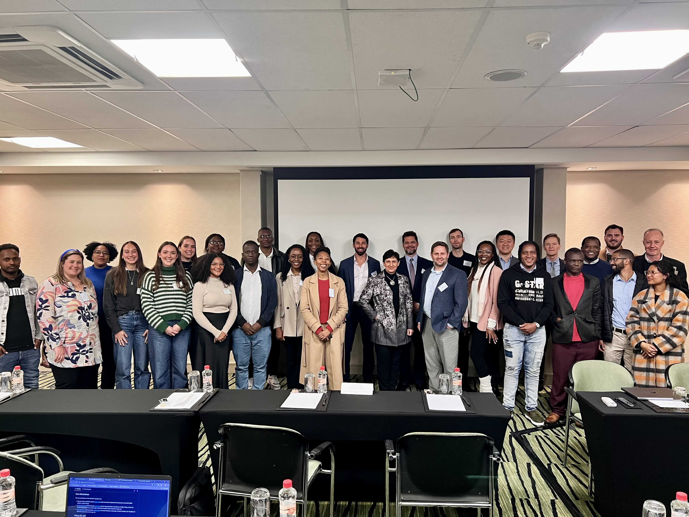
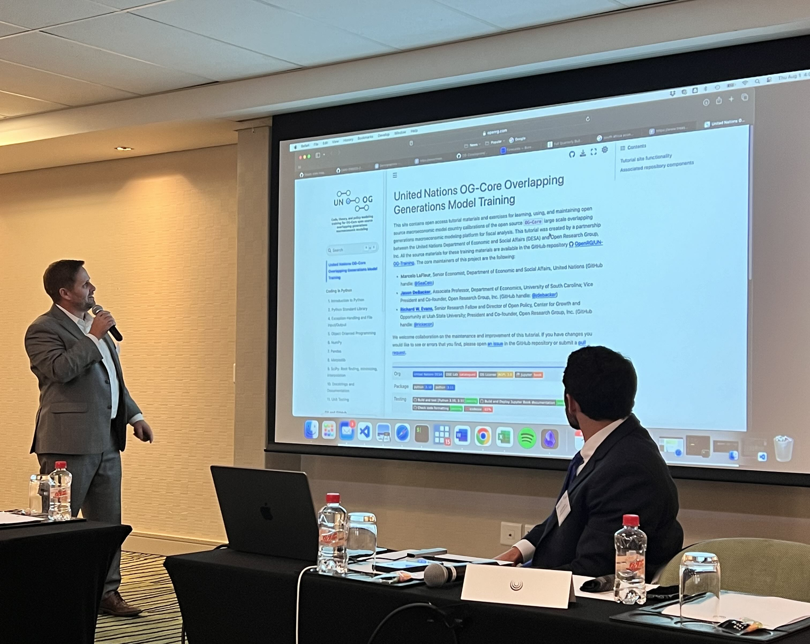
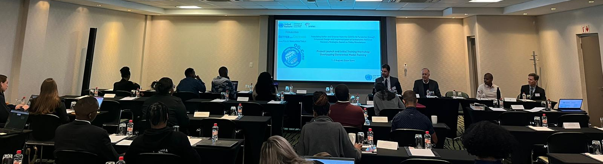
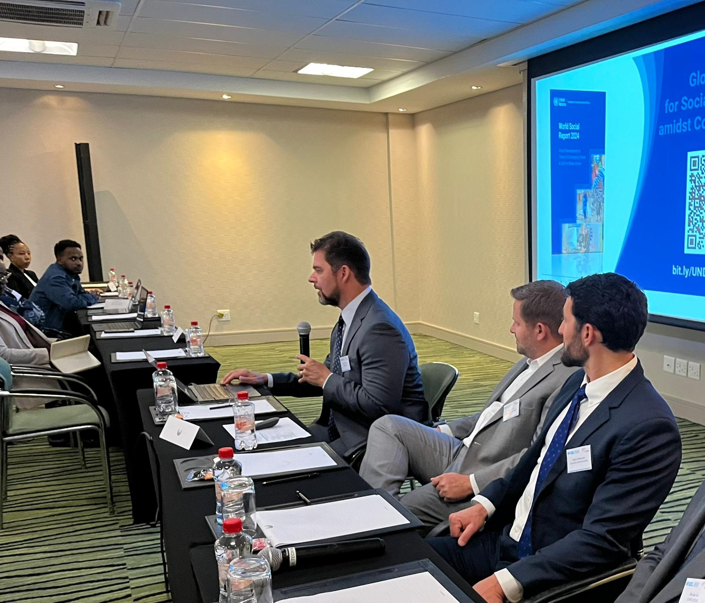

The United Nations Department of Economic and Social Affairs (UNDESA) is implementing a capacity development project aimed at enhancing the design and implementation of sustainable national recovery strategies using policy simulations. To kick off the project, a launch and initial training workshop were organized on 1-2 August 2024 at the Southern Sun Newlands Hotel in Cape Town. The workshop engaged key stakeholders from the National Treasury of South Africa and other relevant institutions.

The workshop began with a welcome and opening session featuring remarks from Marcelo LaFleur, Project Leader and Senior Economic Affairs Officer at UNDESA, along with representatives from the National Treasury of South Africa, the Resident Coordinator Office (RCO), and the Trade Law Centre (tralac). The mission team also conducted a series of sessions aimed at providing an introduction to the OG-Core model, including its assumptions, structure, and key components.

    

Participants from various government agencies and academic institutions were introduced to the current version of the model for South Africa (OG-ZAF) and engaged in brainstorming sessions to discuss policy simulation scenarios relevant to the South African context. The workshop also included hands-on sessions for software installation, troubleshooting, and a tour of the OG-ZAF codebase, focusing on Python programming and collaborative work using GitHub.

The event concluded with a general discussion on the potential applications of the OG-Core model for policy analysis in South Africa, followed by a session on the next steps for the project, including the introduction of an online training tool and plans for future workshops. The closing remarks were delivered by Trudi Hartzenberg, Executive Director of tralac.

### For More Information

{: .box-note}
**Note:** Please see our newsletters. 

