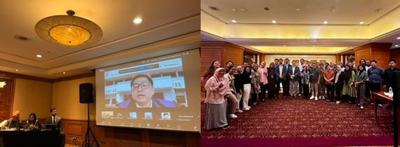
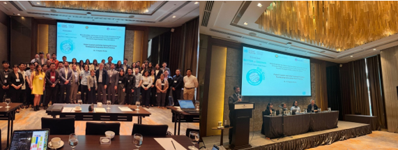

Following the successful launch of the project in South Africa, the United Nations Department of Economic and Social Affairs (UNDESA) conducted two in-person workshops aimed at advancing the "Rebuilding Better and Greener from the COVID-19 Pandemic through Enhanced Design and Implementation of Sustainable National Recovery Strategies Based on Policy Simulations." The workshops, held in Jakarta, Indonesia (6-7 August 2024) and Manila, Philippines (12-13 August 2024), marked an important step in equipping government officials, international organizations, and academic experts with tools to design sustainable economic recovery strategies using advanced policy simulation models.
The workshops focused on the Core Overlapping Generations Macroeconomy Model (OG-CORE), a key tool for simulating national economic policies and their long-term impacts. The first session introduced the project and the OG-CORE model, which is designed to simulate policy scenarios and their implications on various sectors of the economy.
In Indonesia, the event attracted 49 in-person participants, with an additional 25 joining remotely. Attendees included representatives from the Planning Ministry (Bappenas), the Coordinating Ministry for Economic Affairs, the Bank of Indonesia, the Department of Statistics, and regional development agencies. The workshop also featured participants from international organizations, including the World Bank, UNIDO, the UN Resident Coordinator’s Office (UN RCO), and several Indonesian universities.

The Philippines workshop was similarly well-attended, with key participants from the Department of Finance (DOF), the Department of Budget and Management (DBM), the Bangko Sentral ng Pilipinas (BSP), the National Economic and Development Authority (NEDA), and the Department of Statistics. University participants included members of the University of the Philippines Department of Economics and the ACALEO School of Government, alongside experts from the UN RCO.

    

### For More Information

{: .box-note}
**Note:** Please see our newsletters. 

