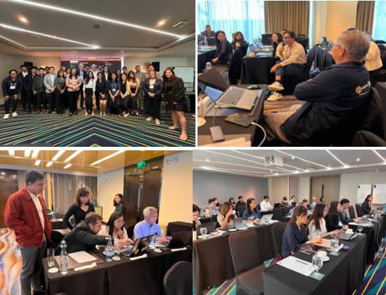

From 21 to 25 October 2024, the United Nations Department of Economic and Social Affairs (UNDESA) conducted the second training workshop for the project "Rebuilding Better and Greener from the COVID-19 Pandemic through Enhanced Design and Implementation of Sustainable National Recovery Strategies Based on Policy Simulations." This advanced workshop, which followed an initial training in August 2024, provided an in-depth exploration of the Philippines Overlapping Generations Macroeconomy Model (OG-PHL).
A total of 27 participants attended the workshop, including key stakeholders from the Department of Budget and Management (DBM), Department of Finance (DOF), Bangko Sentral ng Pilipinas (BSP), National Economic and Development Authority (NEDA), as well as representatives from universities, research institutions, and other organizations involved in national economic planning.
The sessions were structured to ensure participants gained practical experience with the model. After a comprehensive introduction to the project, the team provided detailed presentations on the OG-PHL model, covering its structure, data requirements, and applications in policy simulations. Participants were then guided through the process of setting up the model, calibrating data, and running simulations. These hands-on activities ensured that attendees were fully equipped to integrate the OG-PHL model into their national planning efforts.
The workshop was an important step in empowering key stakeholders in the Philippines with the knowledge and tools needed to create sustainable and resilient national recovery strategies. By enhancing the capacity of policymakers to use advanced modeling techniques, the initiative contributes to the long-term goal of rebuilding the country "better and greener" after the pandemic.

### For More Information

{: .box-note}
**Note:** Please see our newsletters. 

