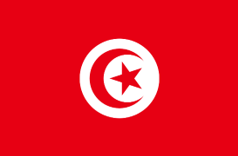

### About the World Economic Forecasting Model (WEFM)

The World Economic Forecasting Model (WEFM) is a global structural econometric macro-modelling system that includes 179 individual country models interconnected through a trade matrix. The country models are characterized by a long run neo-classical supply side and a short run Keynesian demand side. The model is primarily utilized for individual country forecasts in the United Nations’ flagship publication [World Economic Situation and Prospects (WESP)](https://www.un.org/development/desa/dpad/document_gem/global-economic-monitoring-unit/world-economic-situation-and-prospects-wesp-report/) as well as for macroeconomic and development scenarios.

Click [here](https://www.un.org/development/desa/dpad/wp-content/uploads/sites/45/publication/2016_Apr_WorldEconomicForecastingModel.pdf)  to see a detailed explanation of the WEFM model.

### All country projects

The United Nations Department of Economic and Social Affairs (DESA), in collaboration with the Economic and Social Commission for Western Asia (ESCWA), is providing modelling and forecasting training and capacity development in the Arab region (Jordan and Tunisia) to enhance informed policymaking and promote fiscal sustainability.

The project will customize single-country models within the WEFM framework by expanding the fiscal segment to assess the socioeconomic impacts of various social expenditures and their associated fiscal and debt implications. Additionally, the project will train government officials from various ministries as well as think tanks closely working with governments.

### Countries

[./assets/img/jordan.png](/2024-11-29-wefm.md)    
**Jordan** &nbsp;&nbsp;&nbsp;&nbsp;&nbsp;&nbsp;&nbsp;&nbsp;&nbsp;&nbsp;&nbsp;&nbsp;&nbsp;&nbsp;&nbsp;&nbsp;&nbsp;&nbsp;&nbsp;&nbsp;&nbsp;&nbsp;&nbsp;&nbsp;&nbsp;&nbsp;&nbsp;&nbsp;&nbsp;&nbsp;&nbsp;&nbsp;&nbsp;&nbsp;&nbsp;&nbsp;&nbsp;&nbsp; **Tunisia**
